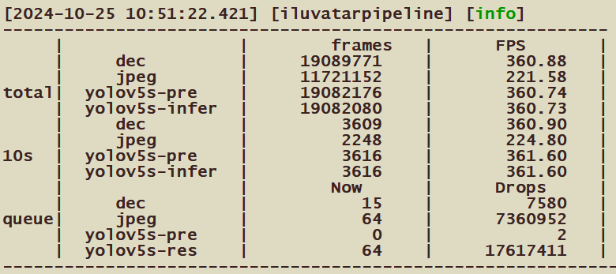

# 项目名称: 视频结构化测试工具

## 项目简介
该项目是一个用于测试硬件解码，cuda预处理，ixRT推理的工具。

## 功能特性
- **多媒体格式支持:** 支持常见的多媒体格式，如H.264、H.265、VP9等，以确保广泛的硬件解码测试覆盖。
  
- **性能评估:** 提供详细的性能指标，包括解码速度、帧率等，帮助用户全面了解硬件解码的表现。

## 如何使用
1. **编译安装:**

   ```bash
   cd iluvatarpipeline

   # 更新ixRT
   cp 3rdparty/ixrt/include/* /usr/local/corex/include/
   cp 3rdparty/ixrt/lib/aarch64/*  /usr/local/corex/lib64/
   #cp 3rdparty/ixrt/lib/x86_64/*  /usr/local/corex/lib64/

   # 安装opencv
   # centos
   yum install mesa-libGL -
   
   # ubuntu
   apt-get install -y libsm6 libxext6 libgl1 libopencv-dev

   # 编译	
   mkdir build 
   cmake .. 
   make -j
   ```

2. **模型转换:**
   请参考models文件夹下对应模型的README，转换onnx模型至ixrt engine。

3. **config参数配置:**

   - rtsp_params.json:配置视频流参数，请修改所有的`rtsp_url`为真实数据流
   ```bash
   {
      "rtsp_url": "rtsp://0.0.0.0:554/test.mp4", #视频流名字
      "rate": 10  #每秒抽帧数，-1则不抽帧
   }
   ```

   - pipeline_one_stage.json: 单阶段模型推理，仅使用yolov5作为推理
   ```bash
   {
      "jpeg_maxBatch": 8,  #jpeg 编码最大batch
      "jpeg_qsz": 64,      #jpeg 编码缓存队列最大图片数量
      "dec_qsz": 64,       #视频 解码缓存队列最大图片数量
      "yolov5s_params": { 
         "resize_h": 640,        #模型预处理高度
         "resize_w": 640,        #模型预处理宽度
         "pre_maxBatch": 32,     #模型预处理最大batch
         "pre_qsz": 10,          #模型预处理缓存队列数量
         "infer_maxBatch": 32,   #模型推理最大batch
         "infer_qsz": 32,        #模型推理缓存队列数量
         "custom_outputs": [     #模型输出名字
               "nms_output0",
               "int_output1"
         ],
         "onnx_file": "../models/yolov5/yolov5s_sim_cut_withnms.onnx",   #模型onnx路径
         "engine_file": "../models/yolov5/yolov5s_sim_cut_withnms.engine"  #模型ixrt engine路径
      }
   }
   ```

   - pipeline_two_stage.json: 二阶段模型推理，先进行ppyoloe检测，在进行pplcnet推理
   ```bash
   {
      "jpeg_maxBatch": 8,  #jpeg 编码最大batch
      "jpeg_qsz": 64,      #jpeg 编码缓存队列最大图片数量
      "dec_qsz": 64,       #视频 解码缓存队列最大图片数量
      "ppyoloe_params": {
         "resize_h": 640,        #模型预处理高度
         "resize_w": 640,        #模型预处理宽度
         "pre_maxBatch": 32,     #模型预处理最大batch
         "pre_qsz": 10,          #模型预处理缓存队列数量
         "infer_maxBatch": 32,   #模型推理最大batch
         "infer_qsz": 32,        #模型推理缓存队列数量
         "custom_outputs": [     #模型输出名字
               "num_detections",
               "detection_boxes",
               "detection_scores",
               "detection_classes"
         ],
         "onnx_file": "../models/ppyoloe/ppyoloe_plus_crn_s_80e_coco_640x640_sim_cut_withnms.onnx",      #模型onnx路径
         "engine_file": "../models/ppyoloe/ppyoloe_plus_crn_s_80e_coco_640x640_sim_cut_withnms.engine"   #模型ixrt engine路径
      },
      "pplcnet_params": {
         "resize_h": 224,
         "resize_w": 224,
         "pre_maxBatch": 8,
         "pre_qsz": 64,
         "infer_maxBatch": 64,
         "infer_qsz": 0,
         "custom_outputs": [
               "softmax_1.tmp_0"
         ],
         "onnx_file": "../models/pplcnet/PPLCNet_x1_0_infer_sim_reshape.onnx",
         "engine_file": "../models/pplcnet/PPLCNet_x1_0_infer_sim_reshape.engine"
      }
   }
   ```
   

4. **运行测试:** 

   - pipeline1: 单阶段模型推理，仅使用yolov5作为推理,log日志进入log文件下查看。
   第一个参数为device id，第二个参数为rtsp配置文件路径
   ```bash
   ./pipeline1 0 ../config/rtsp_params.json
   ```

   - pipeline2: 二阶段模型推理，先进行ppyoloe检测，在进行pplcnet推理
   第一个参数为device id，第二个参数为rtsp配置文件路径
   ```bash
   ./pipeline2 0 ../config/rtsp_params.json
   ```

5. **效果展示:** 
   图中展示32路解码，每路抽取10帧结果。
   - frames表示处理图片数，FPS表示每秒处理图片数。
   - total:程序运行总时间内的各个模块统计结果
   - 10s:10秒内的各个模块统计结果
   - queue:各个模块队列中剩余的图片数和丢弃的图片数
   
   
