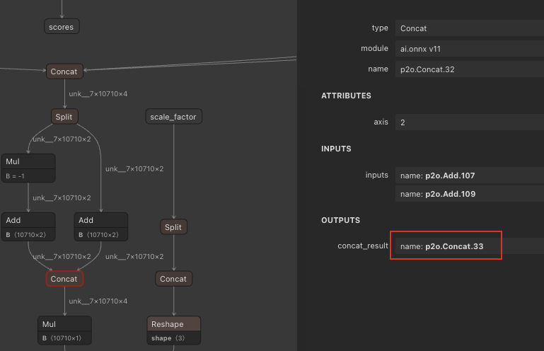

# Paddle2Onnx
## 下载模型

paddle官方模型路径：`https://github.com/PaddlePaddle/PaddleDetection/blob/develop/configs/ppyoloe/README_legacy.md`
```bash
wget https://paddledet.bj.bcebos.com/models/ppyoloe_crn_s_400e_coco.pdparams
```

## 转换onnx

参考paddle官方文档paddle2onnx `https://github.com/PaddlePaddle/PaddleDetection/blob/release/2.7/deploy/EXPORT_ONNX_MODEL.md`

# Onnx2Ixrt

## 简化模型和修改输入大小

需要安装onnxsim
```bash
pip install onnxsim
onnxsim ./ppyoloe_plus_crn_s_80e_coco_640x640.onnx ./ppyoloe_plus_crn_s_80e_coco_640x640_sim.onnx --overwrite-input-shape "image:-1,3,640,640"

onnxsim ./dstmodel_ppyoloe_remove_nms.onnx ./dstmodel_ppyoloe_remove_nms_sim.onnx
```

## 裁剪和填加ixrt-nms算子

1. 裁剪模型
```bash
python3 ./cut_model.py \
        --input_model ./ppyoloe_plus_crn_s_80e_coco_640x640_sim.onnx \
        --output_model ./ppyoloe_plus_crn_s_80e_coco_640x640_sim_cut.onnx  \
        --input_names "image" \
        --output_names "p2o.Mul.224" "p2o.Concat.29"

#注意要找box和score的输出点，如下面模型

python3 ./cut_model.py \
        --input_model ./dstmodel_ppyoloe_remove_nms_sim.onnx \
        --output_model ./dstmodel_ppyoloe_remove_nms_sim_cut.onnx  \
        --input_names "image" \
        --output_names "p2o.Mul.23" "p2o.Concat.29"

```



2. 填加ixrt-nms算子

```bash
python3 ./customize_op_for_model.py \
        --src ./ppyoloe_plus_crn_s_80e_coco_640x640_sim_cut.onnx \
        --dest ./ppyoloe_plus_crn_s_80e_coco_640x640_sim_cut_withnms.onnx \
        --fusion_names "p2o.Mul.224" "p2o.Concat.29" \
        --max_output_boxes 1000 \
        --score_threshold 0.3 \
        --iou_threshold 0.5

python3 ./yzc_customize_op.py \
        --src ./dstmodel_ppyoloe_remove_nms_sim_cut.onnx \
        --dest ./dstmodel_ppyoloe_remove_nms_sim_cut_nms.onnx \
        --fusion_names "p2o.Mul.22" "p2o.Concat.29" \
        --max_output_boxes 1000 \
        --score_threshold 0.7 \
        --iou_threshold 0.5

```

## 转换ixrt engine
```bash
ixrtexec --onnx ./ppyoloe_plus_crn_s_80e_coco_640x640_sim_cut_withnms.onnx \
        --precision fp16 \
        --min_shape image:1x3x640x640 \
        --opt_shape image:16x3x640x640 \
        --max_shape image:32x3x640x640 \
        --plugins /usr/local/corex/lib/liboss_ixrt_plugin.so \
        --save_engine ./ppyoloe_plus_crn_s_80e_coco_640x640_sim_cut_withnms.engine 

ixrtexec --onnx ./dstmodel_ppyoloe_remove_nms_sim_cut_nms.onnx \
        --precision fp16 \
        --min_shape image:1x3x544x960 \
        --opt_shape image:16x3x544x960 \
        --max_shape image:32x3x544x960 \
        --plugins /usr/local/lib/python3.10/site-packages/ixrt/lib/liboss_ixrt_plugin.so \
        --save_engine ./dstmodel_ppyoloe_remove_nms_sim_cut_nms.engine 
```

## python测试脚本
```bash
python3 ./inference_ixrt_dyn.py \
        --model_engine ./ppyoloe_plus_crn_s_80e_coco_640x640_sim_cut_withnms.engine \
        --input_image ./dog_640.jpg

python3 ./inference_ixrt_dyn.py \
        --model_engine ./dstmodel_ppyoloe_remove_nms_sim_cut_nms.engine \
        --input_image ./resized_output.jpg
```